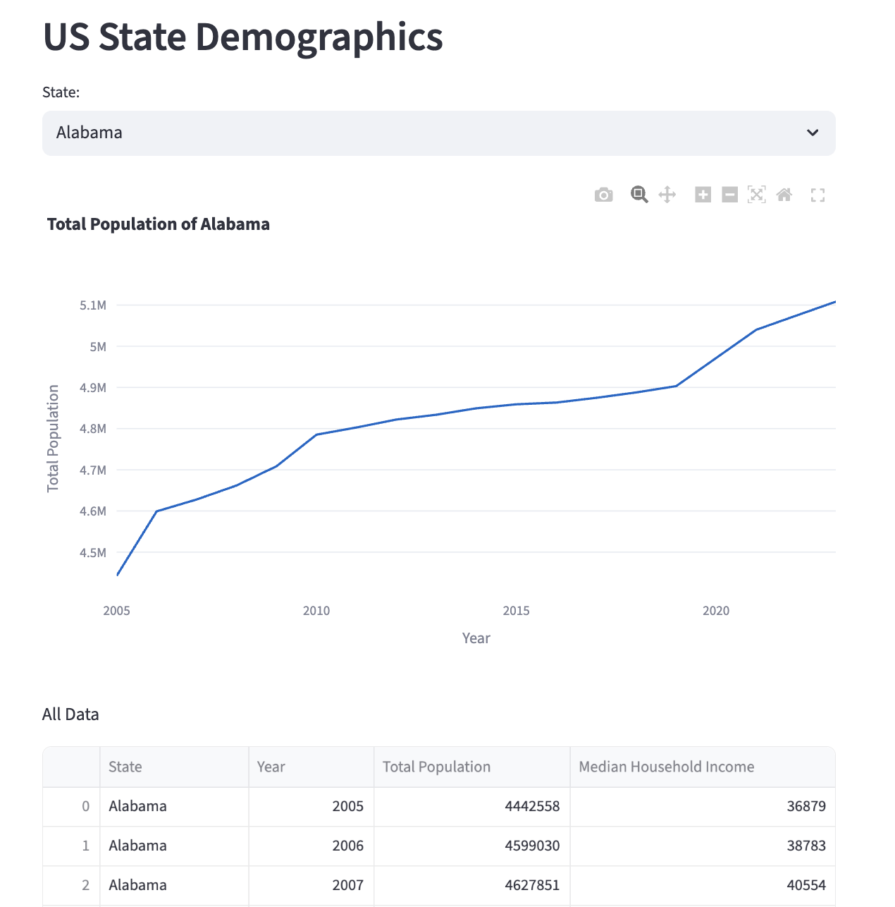

# streamlit_tutorial

This repository walks you through creating and deploying a data app in Python using
[Streamlit](https://streamlit.io/). It contains:

  * A small demo app to get you started. This app contains interesting, real-world data.
  * Instructions for installing, running, and modifying the demo app on your local machine.
  * Exercises for improving the app. Solving these problems will help you learn Streamlit.
  * Instructions for deploying your finished app to the internet. This will let you share it with friends and family.

You can view the final app [here](https://arilamstein-tutorial.streamlit.app/).

### Prerequisites

This tutorial assumes that you have some familiarity with the terminal / command line. It also assumes that you have git installed on your local machine.

Prior experience with git and Python is helpful but not necessary. 

You do not need to have Python installed prior to starting this tutorial. 

### Setup

1. Fork this repository in Github
   ([instructions](https://docs.github.com/en/pull-requests/collaborating-with-pull-requests/working-with-forks/fork-a-repo?tool=desktop)).
1. Clone your fork to your local machine ([instructions](https://docs.github.com/en/repositories/creating-and-managing-repositories/cloning-a-repository)).
1. Install uv ([instructions](https://docs.astral.sh/uv/#installation)). 
1. In your terminal, navigate to the directory that contains this repo and type `uv sync`. This will create a
   virtual environment in the project's `.venv` directory.  

The above instructions need to be executed just once.

### Run the Demo App

After completing the steps in the "Setup" section you can run the demo app.

1. First activate the project's virtual environment: In the terminal, navigate to the project's directory and type `source .venv/bin/activate`.
1. Then type `streamlit run streamlit_app.py` in the terminal. 

A browser should open that contains the demo app. It should look like this:

  

### Streamlit Basics

1. While the app is running, open the file [streamlit_app.py](streamlit_app.py). Can you guess what each line of
   the file does?
1. Streamlit apps can reload after you make changes to the source code. That is, you don't need to stop and restart the app to
   see the result of your changes. 
1. While the app is running, change the text in the
   `st.header` call (line 7) to be "Changes in US State Demographics Over Time". Save the file. 
1. The app should now have
   a button in the upper right that says "Rerun". Click it. The app should update with the new text.
   
### Modify the App 

The best way to learn Streamlit is to solve small, real-world problems on an existing app. Open the file
[exercises.md](exercises.md) and try to complete the tasks listed there. They ask you to modify the demo app by:
1. Adding a new graph.
1. Adding a new input widget.
1. Using the value from input widgets when creating a graph. 
1. Using tabs to make the app easier to navigate. 

These are common tasks when working in Streamlit. If you get stuck, check my solutions in `solution_app.py`.

After you have finished the exercises, commit your changes and push them to Github.

### Deploy Your App

Streamlit makes it easy to share your app with others. When your app is running, there should be a "Deploy" button in
the upper right. Click it and follow the instructions that appear.

I encourage you to share your app with friends and family!

### Conclusion

Congratulations: You have now cloned, modified, and deployed your first Streamlit app!

If you found this tutorial helpful, please give the repo a star and share it with your friends. 

If you have feedback on the tutorial, feel free to reach out via my website: [AriLamstein.com](https://arilamstein.com/).